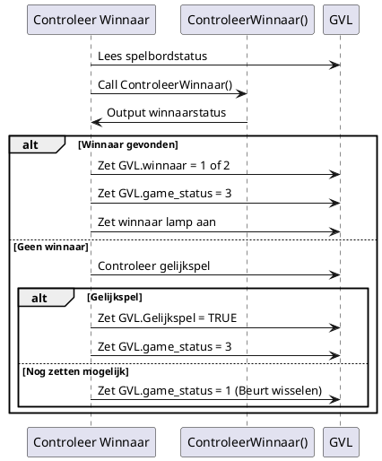

# 4.Sequence Diagram for Function Calling

```plantuml
@startuml

skinparam backgroundcolor transparent

participant Task3 as "Controleer Winnaar"
participant Function as "ControleerWinnaar()"
participant GVL

Task3 -> GVL : Lees spelbordstatus
Task3 -> Function : Call ControleerWinnaar()

Function -> Task3 : Output winnaarstatus

alt Winnaar gevonden
    Task3 -> GVL : Zet GVL.winnaar = 1 of 2
    Task3 -> GVL : Zet GVL.game_status = 3
    Task3 -> GVL : Zet winnaar lamp aan
else Geen winnaar
    Task3 -> GVL : Controleer gelijkspel
    alt Gelijkspel
        Task3 -> GVL : Zet GVL.Gelijkspel = TRUE
        Task3 -> GVL : Zet GVL.game_status = 3
    else Nog zetten mogelijk
        Task3 -> GVL : Zet GVL.game_status = 1 (Beurt wisselen)
    end
end

@enduml


```

Uitleg:

- Dit diagram toont de functie winnaar aan.

