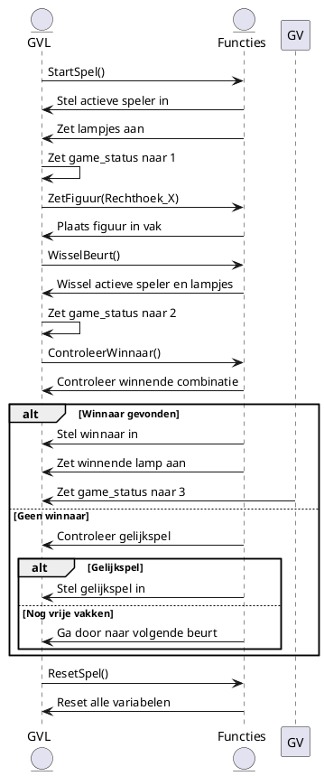

# 4.Sequence Diagram for Function Calling

Uitleg:

- Dit diagram toont de interacties tussen de speler, de spelvariabelen en de functies die de logica van het spel beheren. Het laat zien hoe functies worden aangeroepen om de status van het spel bij te houden en de spelbeurten te beheren.

