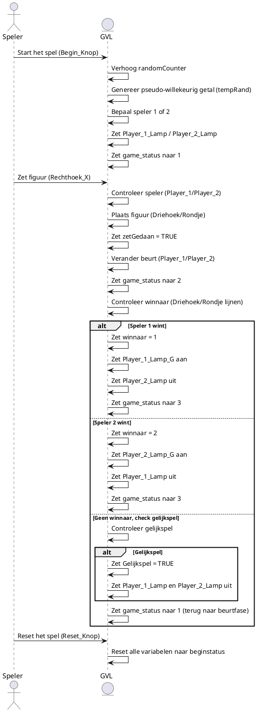

# 3.Sequence Diagram for Task Communication

Uitleg:

- Het sequentie diagram toont de communicatie tussen de speler (Speler), de spelvariabelen (GVL), en de functies die de kernlogica van het spel verwerken. De flow omvat het starten van het spel, het plaatsen van zetten, het controleren van winnaars en het resetten van het spel.