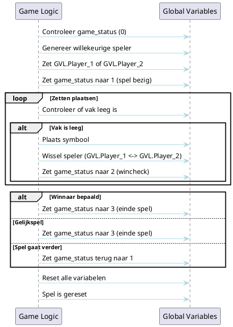

# 3.Sequence Diagram for Task Communication

```plantuml

@startuml

skinparam backgroundcolor transparent
skinparam arrowcolor lightblue

participant "Game Logic" as GVL
participant "Global Variables" as GVL_VARS

GVL -> GVL_VARS: Controleer game_status (0)
GVL -> GVL_VARS: Genereer willekeurige speler
GVL -> GVL_VARS: Zet GVL.Player_1 of GVL.Player_2
GVL -> GVL_VARS: Zet game_status naar 1 (spel bezig)

loop Zetten plaatsen
    GVL -> GVL_VARS: Controleer of vak leeg is
    alt Vak is leeg
        GVL -> GVL_VARS: Plaats symbool
        GVL -> GVL_VARS: Wissel speler (GVL.Player_1 <-> GVL.Player_2)
        GVL -> GVL_VARS: Zet game_status naar 2 (wincheck)
    end
end

alt Winnaar bepaald
    GVL -> GVL_VARS: Zet game_status naar 3 (einde spel)
else Gelijkspel
    GVL -> GVL_VARS: Zet game_status naar 3 (einde spel)
else Spel gaat verder
    GVL -> GVL_VARS: Zet game_status terug naar 1
end

GVL -> GVL_VARS: Reset alle variabelen
GVL -> GVL_VARS: Spel is gereset
@enduml


```
Uitleg:

- Het sequentie diagram toont de communicatie.