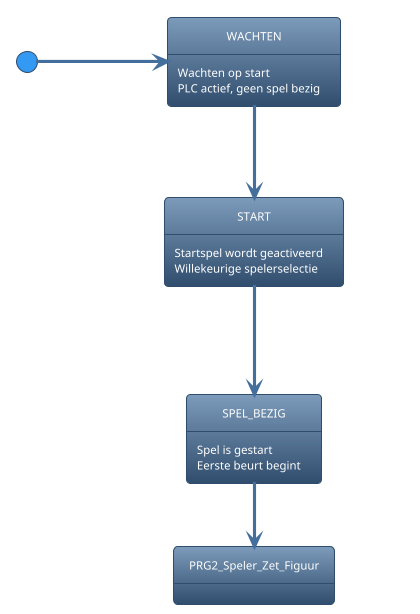
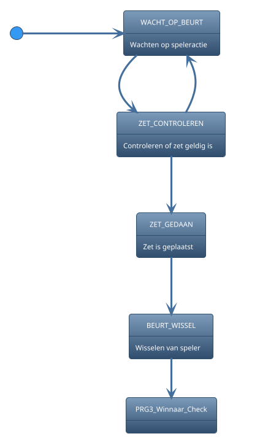
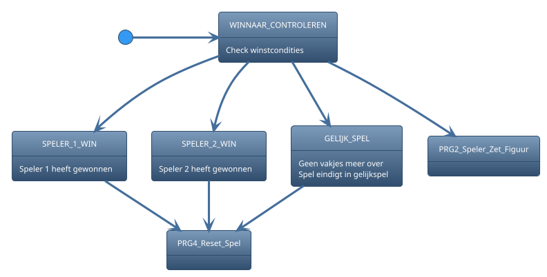
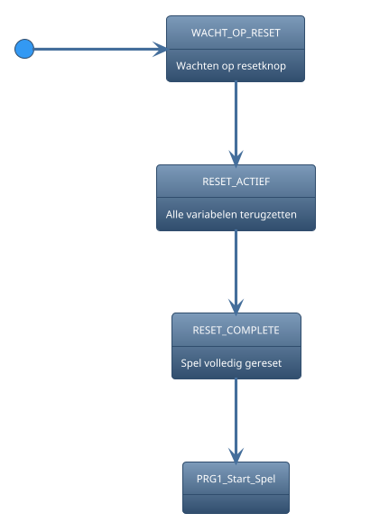

# 2.Tasks

## 2.1.State Diagram for Task 1: Game Initialization

## 2.2.State Diagram for Task 2: Player Turn

## 2.3.State Diagram for Task 3: Win or Draw Check

## 2.4.State Diagram for Task 4: Reset Game

