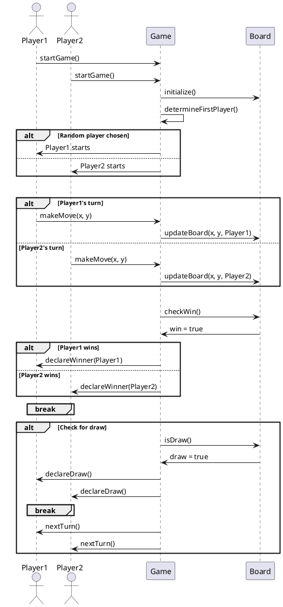

# Tic-tac-toe
'Hier is de diagram gemaakt van Tic-tac-toe'
fwes

```plantuml

@startuml
actor Player1
actor Player2
participant "Game" as Game
participant "Board" as Board

Player1 -> Game: startGame()
Player2 -> Game: startGame()
Game -> Board: initialize()

Game -> Game: determineFirstPlayer()
alt Random player chosen
    Game -> Player1: Player1 starts
else
    Game -> Player2: Player2 starts
end

loop each turn
    alt Player1's turn
        Player1 -> Game: makeMove(x, y)
        Game -> Board: updateBoard(x, y, Player1)
    else Player2's turn
        Player2 -> Game: makeMove(x, y)
        Game -> Board: updateBoard(x, y, Player2)
    end

    alt Check for win
        Game -> Board: checkWin()
        Board -> Game: win = true
        alt Player1 wins
            Game -> Player1: declareWinner(Player1)
        else Player2 wins
            Game -> Player2: declareWinner(Player2)
        end
        break
    end

    alt Check for draw
        Game -> Board: isDraw()
        Board -> Game: draw = true
        Game -> Player1: declareDraw()
        Game -> Player2: declareDraw()
        break
    end
    
    Game -> Player1: nextTurn()
    Game -> Player2: nextTurn()
end
@enduml


```
