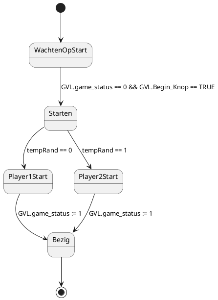
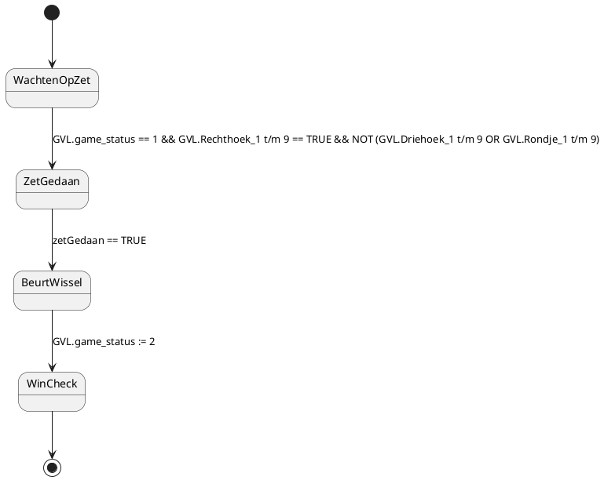
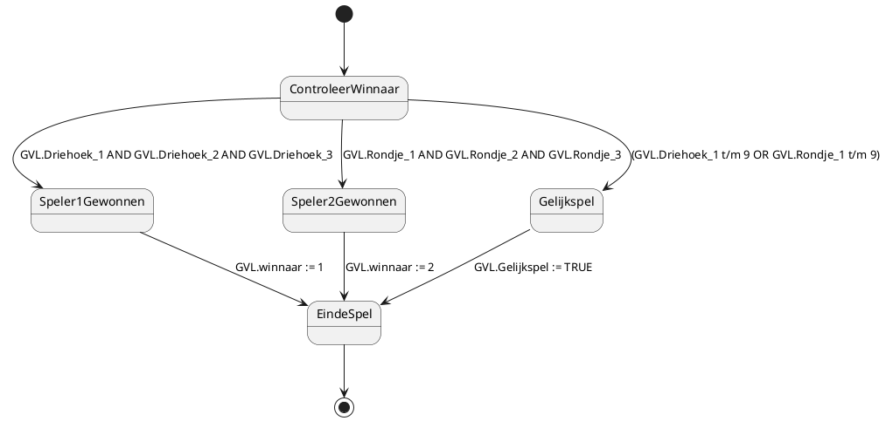
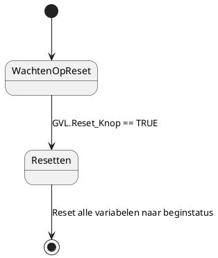

# 2.Tasks

## 2.1.State Diagram for Task 1: Game Initialization

Uitleg:

- WachtenOpStart: De initiële toestand waarbij het spel wacht op de startknop (Begin_Knop).
- Starten: Wanneer het spel start, wordt de waarde van GVL.game_status en GVL.Begin_Knop gecontroleerd om naar de volgende toestand over te schakelen.
- Player1Start/Player2Start: Afhankelijk van een willekeurig getal (tempRand), wordt ofwel Speler 1 of Speler 2 geselecteerd.
- Bezig: Nadat de speler is gekozen, wordt de game_status op 1 gezet, wat betekent dat het spel bezig is.

## 2.2.State Diagram for Task 2: Player Turn

Uitleg:

- WachtenOpZet: Het spel wacht op de speler om een zet te doen (door een leeg vakje te selecteren).
- ZetGedaan: Zodra een geldige zet is gedaan (een leeg vakje wordt ingevuld), wordt de zetGedaan vlag op TRUE gezet.
- BeurtWissel: Na de zet wordt gecontroleerd of het tijd is om van beurt te wisselen.
- WinCheck: Het spel schakelt over naar de win-controle fase (GVL.game_status := 2).

## 2.3.State Diagram for Task 3: Win or Draw Check

Uitleg:

- ControleerWinnaar: Het spel controleert of een speler heeft gewonnen of dat er een gelijkspel is.
- Speler1Gewonnen/Speler2Gewonnen: Als een speler wint, wordt de juiste winnaar gedeclareerd en verandert de status van het spel.
- Gelijkspel: Als er geen winnaar is en alle vakjes zijn ingevuld, is het een gelijkspel.
- EindeSpel: Markeert het einde van het spel, of het nu een winst of gelijkspel is.

## 2.4.State Diagram for Task 4: Reset Game

Uitleg:

- WachtenOpReset: Het spel wacht op een reset-signaal.
- Resetten: Wanneer de resetknop wordt ingedrukt (GVL.Reset_Knop), worden alle variabelen gereset naar hun oorspronkelijke staat.
