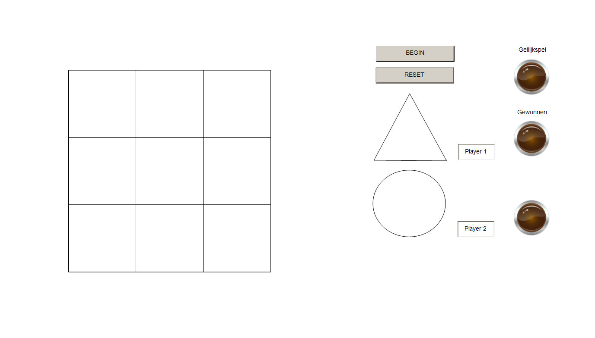

# 1.Introductie

Tijdens het vak Proces en Safety heb ik de opdracht gekregen om een programma te ontwikkelen met minimaal twee taken die met elkaar communiceren. Dit programma is geprogrammeerd in VS maar dan met een TwinCAT plugin, een ontwikkelomgeving voor PLC-toepassingen.

De opdracht omvatte de volgende vereisten:

- Het schrijven van een klein PLC-programma in Structured Text voor een zelfgekozen proces.
- Het programma moest twee onafhankelijke taken bevatten die met elkaar communiceren.
- Er moest minstens één functie worden aangeroepen door een van de taken.
- Een Global Variable List (GVL) waarin beide taken variabelen kunnen lezen en schrijven.

Voor de documentatie moesten er de volgende diagrammen worden aangeleverd:

- Een state diagram voor elke taak.
- Een sequence diagram dat de communicatie tussen de taken toont.
- Een sequence diagram dat de aanroep van de functie door de taak weergeeft.

Ik heb ervoor gekozen om een TicTacToe-spel te ontwikkelen, omdat ik het een leuk spel vind en het een uitstekende gelegenheid bood om de vereiste onderdelen van de opdracht, zoals de onafhankelijke taken, functie-aanroepen en communicatie via de GVL, te implementeren.

# Programma Tictactoe
 Hier is een downloadlink voor het downloaden van alleen het programma.
[Download de Code op GitHub](https://github.com/JurOtten/Proces-Safety/tree/master/Code)

